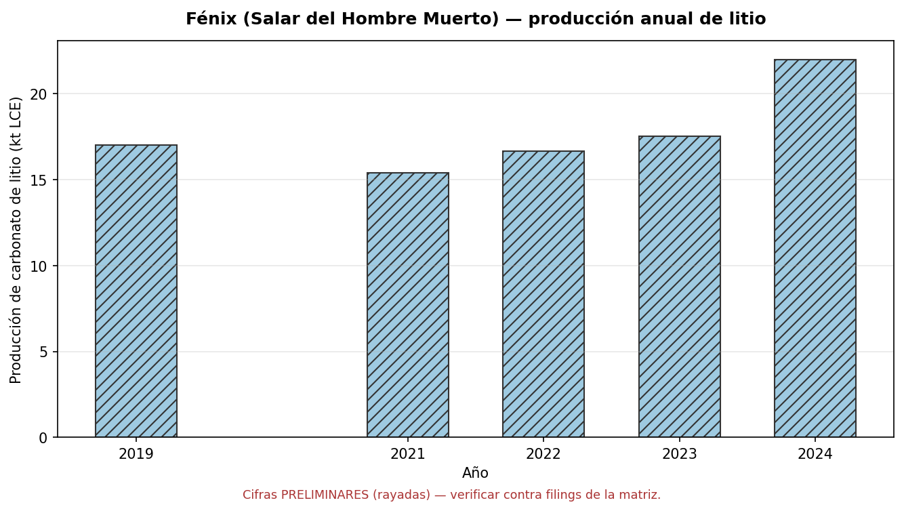

# Salar del Hombre Muerto (Argentina)

El caso **público** del experimento: un salar donde el operador cotiza y publica datos de producción, y
donde el catastro minero permite ubicar la concesión. La tesis es cruzar la **deformación InSAR** con la
**actividad declarada** y ver si coinciden en espacio y tiempo.

## La operación

| Dato | Valor |
|---|---|
| Ubicación | Salar del Hombre Muerto, Catamarca / Salta (Puna argentina, ~4.000 m s.n.m.) |
| Proyecto | **Fénix**, operado por **Minera del Altiplano S.A.** |
| Matriz | Livent → **Arcadium Lithium** (ene-2024) → **Rio Tinto** (mar-2025) |
| Método | bombeo de salmuera + **piletas de evaporación** solar → carbonato de litio |
| Capacidad reportada | ~40 ktpy LCE (meta 2023) con expansión hacia ~60 ktpy LCE | 

*Cifras de capacidad según reportes públicos del operador/medios; a verificar contra los filings de la matriz.*

!!! note "Por qué este salar"
    Es una operación **madura y en expansión** (más de dos décadas), con producción **declarada** por una
    empresa que cotiza, y vecina a otros proyectos de la Puna. Eso permite contrastar el satélite contra el
    dato oficial — lo opuesto al [caso opaco](salar-opaco.md).

## Datos públicos a cruzar

- **Producción de litio (LCE) por año** — de los reportes de la matriz (Livent/Arcadium/Rio Tinto) y de la
  Secretaría de Minería de la Nación. Sirve para la curva "producción ↔ subsidencia" análoga a la de
  producción de Vaca Muerta.
- **Concesión / pertenencias mineras** — catastro minero nacional (SEGEMAR) y provincial (Catamarca).
  **Disponibilidad de polígonos a verificar**; si no hay GeoJSON público, se digitalizan las **piletas de
  evaporación** desde imágenes Sentinel-2 (son enormes y de borde nítido) y se cargan en
  `pipeline/overlay.geojson`.
- **Imagen óptica (Sentinel-2)** — para datar la **expansión de las piletas** en el tiempo y compararla con
  el avance del bowl de subsidencia.

## Producción anual de litio (preliminar)

{ loading=lazy }

*Producción de carbonato de litio (kt LCE) por año en Fénix. Generado con `produccion_litio.py` a partir de
`produccion_litio.csv`.*

!!! danger "Cifras preliminares — verificar"
    Estos valores (≈17 kt en 2019; 15,4 / 16,7 / 17,5 kt en 2021–2023; ≈22 kt en 2024; 2020 sin dato
    confirmado) provienen de **resúmenes públicos de reportes** de la matriz (Livent / Arcadium) y **no están
    verificados** contra los filings primarios (SEC 10-K / 8-K). Por eso las barras van **rayadas**. Tras la
    compra por Rio Tinto (2025) se discontinuó el reporte por sitio. Antes de cualquier conclusión hay que
    reemplazarlos por las cifras oficiales en `produccion_litio.csv` (columna `verificado`).

La idea del cruce: superponer esta curva con la **subsidencia acumulada** del bowl (cuando exista la serie
InSAR) para ver si el ritmo de hundimiento acompaña al de extracción — análogo al cruce producción↔subsidencia
de Vaca Muerta.

## Estado del análisis

!!! warning "Pendiente de la primera corrida"
    Falta correr la cadena InSAR sobre el AOI (ver [Método](metodo.md)) y completar:

    - [x] Elegir el track Sentinel-1 con `01_search.py` y fijarlo en `aoi.py` (**track 83 descendente**).
    - [x] Punto de referencia Fénix fijado al centroide del polígono OSM "Proyecto Fenix" (`overlay_osm.py`).
    - [x] Overlay de piletas / industria desde OpenStreetMap → `pipeline/overlay.geojson` (151 polígonos).
    - [x] Serie anual de producción de litio (preliminar) → `produccion_litio.csv` + gráfico.
    - [ ] Refinar el bounding box contra la imagen satelital (verificación fina).
    - [ ] Generar el mapa de velocidad y el slider ([Resultados](resultados.md)) — requiere los productos InSAR.
    - [ ] Verificar las cifras de producción contra los filings primarios.
